<h2>TensorFlow-FlexUNet-Image-Segmentation-BrainMetShare-FLAIR (2026/09/22)</h2>
Sarah T. Arai 
Software Laboratory antillia.com   
This is the second experiment in Image Segmentation for <b>Brain Metastases</b>
our <a href="https://github.com/sarah-antillia/TensorFlow-FlexUNet-Image-Segmentation-Model">TensorFlowFlexUNet Model</a>
 (<b>TensorFlow Flexible UNet Image Segmentation Model for Multiclass</b>) and a 256x256-pixel PNG
 <a href="https://drive.google.com/file/d/1mvjlaAMHIkLQwwl2yBeACJu11fJKqiDp/view?usp=sharing">
BrainMetShare-FLAIR.zip</a>,
  which was derived by us from the Kaggle website 
  
<a href="https://www.kaggle.com/datasets/venka18tesan/brainmetshare-3">
<b>BrainMetShare-3</b>
</a> 
 by Venkatesan M.
  
For the first experiment, please refer to  <a href="https://github.com/sarah-antillia/TensorFlow-FlexUNet-Image-Segmentation-Brain-Metastases-MRI-Flair">
TensorFlow-FlexUNet-Image-Segmentation-Brain-Metastases-MRI-Flair</a>
   

<b>Actual Image Segmentation for BrainMetShare-FLAIR Images of 256x256 pixels</b> 
As shown below, the inferred masks resemble the ground-truth masks.  
 
<table>
<tr>
<th>Input: image</th>
<th>Mask (ground_truth)</th>
<th>Prediction: inferred_mask</th>
</tr>
<tr>
<td>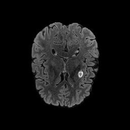</td>
<td></td>
<td></td>
</tr>
<tr>
<td>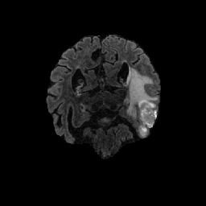</td>
<td></td>
<td></td>
</tr>
<tr>
<td>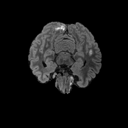</td>
<td></td>
<td></td>
</tr>
</table>

 
<h3>1. Dataset Citation</h3>
The dataset used here was derived from the following Kaggle website:  
  
<a href="https://www.kaggle.com/datasets/venka18tesan/brainmetshare-3">
<b>BrainMetShare-3</b>
</a> 
 by Venkatesan M.
  
The following explanation (excerpt) was taken from the website above.
  
<b>About Dataset</b> 
A brain MRI dataset to develop and test improved methods for detection and segmentation of brain metastases.  
The dataset includes 156 whole brain MRI studies, including high-resolution, multi-modal pre- 
and post-contrast sequences in patients with at least 1 brain metastasis accompanied by ground-truth segmentations
 by radiologists.  
 
  About 2% of all patients with a primary neoplasm will be diagnosed with brain metastases at the time of 
  their initial diagnosis. As we are getting better at controlling primary cancers, even more patients 
  eventually present with such lesions. Given that brain metastases are often quite treatable with 
  surgery or stereotactic radiosurgery, accurate segmentation of brain metastases is a common job 
  for radiologists.   
Having algorithms to help detect and localize brain metastasis could relieve radiologists from 
this tedious but crucial task. Given the success of recent AI techniques on other segmentation tasks, 
we have put together this gold-standard, labeled MRI dataset to allow for the development and 
testing of new techniques in these patients with the hopes of spurring research in this area.   
This is a dataset of 156 pre- and post-contrast whole brain MRI studies in patients with at least 1 cerebral 
metastasis. Mean patient age was 63±12 years (range: 29–92 years). 
Primary malignancies included lung (n = 99), breast (n = 33), melanoma (n = 7), genitourinary (n = 7), 
gastrointestinal (n = 5), and miscellaneous cancers (n = 5). 
The specific primary malignancies for each case are included in an excel sheet that can be downloaded 
with the data. 64 (41%) had 1–3 metastases, 47 (30%) had 4–10 metastases, and 45 (29%) had >10 metastases.
 
 Lesion sizes varied from 2 mm to over 4 cm and were scattered in every region of the brain parenchyma, 
 i.e., the supratentorial and infratentorial regions, as well as the cortical and subcortical structures. 
  
 It includes 4 different 3D sequences:  
<b>T1 spin-echo pre-contrast</b> 
<b>T1 spin-echo post-contrast</b>  
<b>T1 gradient-echo post (using an IR-prepped FSPGR sequence)</b>  
<b>T2 FLAIR post</b>  
 
in the axial plane, co-registered to each other, resampled to 256 x 256 pixels. 
<!--
 The nominal in-plane resolution is 0.94 mm and the through-plane resolution is 1.0 mm. Standard dose 
 (0.1 mmol/kg) gadolinium contrast agents were used for all cases. 
 All the images have been skull-stripped by using the Brain Extraction Tool (BET) 
 (Smith SM. Fast robust automated brain extraction. Hum Brain Map. 2002;17:143–155). 
 The brain masks were generated from the precontrast T1-weighted 3D CUBE imaging series 
 using the nordicICE software package (NordicNeuroLab, Bergen, Norway) and propagated to the other sequences.
  
  For 105 cases, we include radiologist-drawn segmentations of the metastatic lesions,
   stored in folder ‘mets_stanford_release_train’. The segmentations were based on the 
   T1 gradient-echo post-contrast images. The remaining 51 cases are unlabeled and stored in 
   ‘mets_stanford_release_test’.  
    
There are 5 folders for each subject in the training group – folder ‘0’ contains T1 gradient-echo post 
images; folder ‘1’ contains T1 spin-echo pre images; folder ‘2’ contains T1 spin-echo post images; 
folder ‘3’ contains T2 FLAIR post images; folder ‘seg’ contains a binary mask of the 
segmented metastases (0, 255).  
There are 4 folders for each subject in the testing group,
 which are labelled identically, except for the absence of folder ‘seg’.
  
-->
 
  More detailed information on this dataset and the Stanford group’s initial performance on 
  this data set can be found in  
  Grøvik et al., Deep Learning Enables Automatic Detection and Segmentation 
  of Brain Metastases on Multisequence MRI,  
  JMRI 2019; 51(1):175-182. 
<!--
    
  We would like to thank the team involved with labeling and preparing the data and for checking 
  it for potential PHI: Darvin Yi, Endre Grovik, Elizabeth Tong, Michael Iv, Daniel Rubin, 
  Greg Zaharchuk, and Ghiam Yamin, and the Division of Neuroimaging at Stanford 
  for supporting this project. Grøvik et al., Deep Learning Enables Automatic Detection 
  and Segmentation of Brain Metastases on Multisequence MRI, 
  JMRI 2019; 51(1):175-182 also available on ArXiv (https://arxiv.org/abs/1903.07988).
  
-->
   
<b>License</b> 
Unknown.
 
 
<h3>
2. BrainMetShare-FLAIR-ImageMask-Subset
</h3>
<h3>2.1 Download ImageMask Dataset</h3>
 If you would like to train this BrainMetShare-FLAIR Segmentation model,
 please download the dataset from Google Drive  
 <a href="https://drive.google.com/file/d/1mvjlaAMHIkLQwwl2yBeACJu11fJKqiDp/view?usp=sharing">
BrainMetShare-FLAIR.zip</a> . 
Expand the downloaded ImageMaskDataset and put it under <b>./dataset</b> folder to be
 
<pre>
./dataset
└─BrainMetShare-FLAIR
    ├─test
    │   ├─images
    │   └─masks
    ├─train
    │   ├─images
    │   └─masks
    └─valid
         ├─images
         └─masks
</pre>
 
<b>BrainMetShare-FLAIR Statistics</b> 
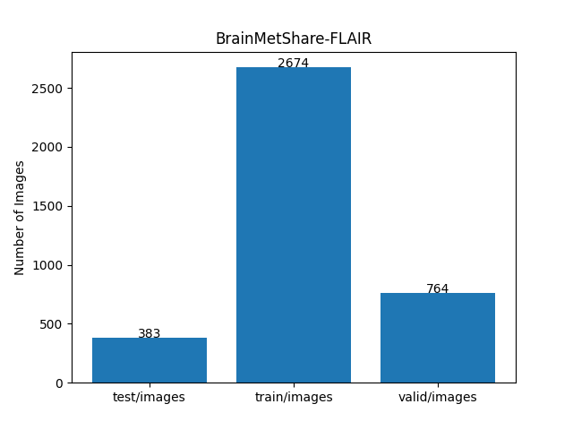 
 
As shown above, the number of images in the training and validation datasets is large enough to use for the
 training set of our segmentation model.
 
 
<h3>2.2 Derivation of BrainMetShare-FLAIR </h3>
The original train dataset's folder structure is as follows.
It contains four modalities (bravo, flair, ti1_gd, and t1_pre) of NIfTI files and one corresponding 
 seg.nii NIfTI segmentation files,
<pre>
./brainmetshare
  └─train  
       ├─Mets_001
       │   ├─bravo.nii
       │   ├─flair.nii
       │   ├─seg.nii
       │   ├─t1_gd.nii
       │   └─t1_pre.nii
...
       └─Mets_105
            ├─bravo.nii
            ├─flair.nii
            ├─seg.nii
            ├─t1_gd.nii
            └─t1_pre.nii
</pre>
We generated a 256x256 pixels PNG FLAIR ImageMask Dataset  
 from the image slices of <b>flair.nii</b> 
and the correspoding mask slices of <b>seg.nii</b> in all <b>Mets_*</b> subfolders in <b>train</b> folder.
However, for simplicity, we excluded all black empty masks and the corresponding images because they are irrelevant for 
training our segmentation model.  
 

<h3>2.3 Train Sample Images and Masks</h3>
<b>Train_sample_images</b> 
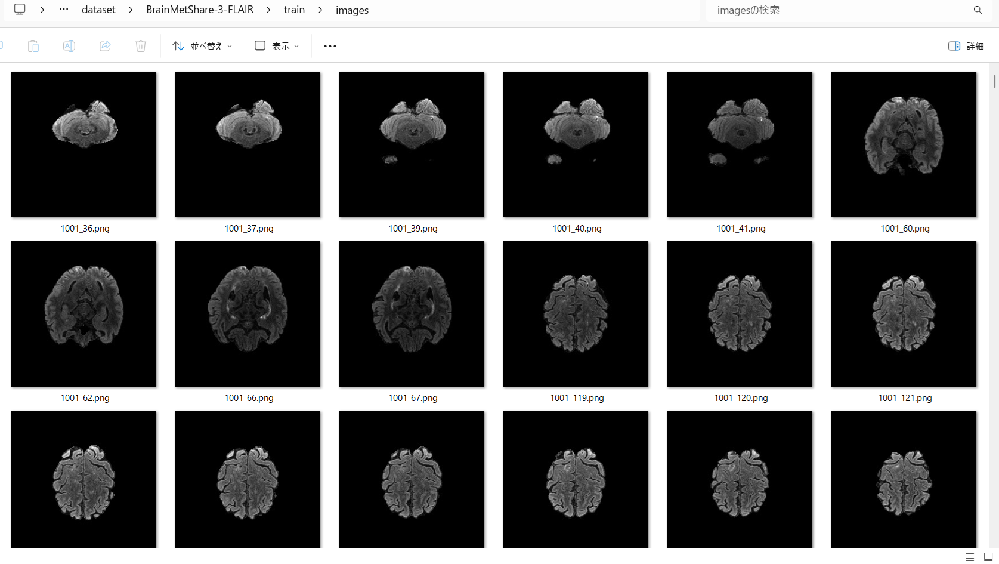
 
<b>Train_sample_masks</b> 
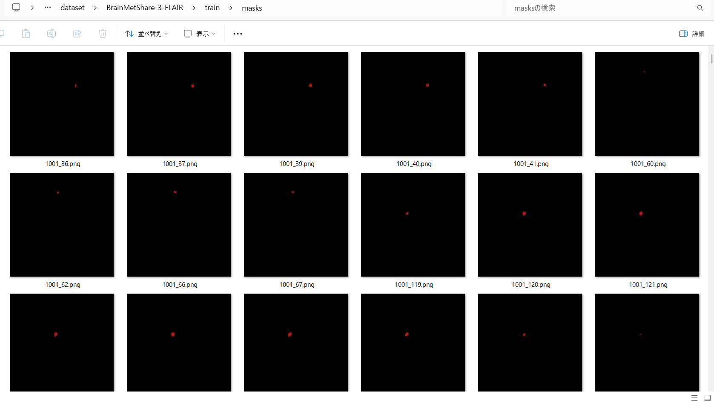
 

<h3>
3. Train TensorFlowFlexUNet Model
</h3>
 We trained the BrainMetShare-FLAIR TensorFlowFlexUNet model using the following
<a href="./projects/TensorFlowFlexUNet/BrainMetShare-FLAIR/train_eval_infer.config"> <b>train_eval_infer.config</b></a> file.  
Please move to ./projects/TensorFlowFlexUNet/BrainMetShare-FLAIR and run the following bat file. 
<pre>
>1.train.bat
</pre>
This simply runs the following command. 
<pre>
>python ../../../src/TensorFlowFlexUNetTrainer.py ./train_eval_infer.config
</pre>

<b>Model parameters</b> 
Defined a small <b>base_filters=16 </b> and large <b>base_kernels=(11,11)</b> for the first Conv Layer of Encoder Block of 
<a href="./src/TensorFlowFlexUNet.py">TensorFlowFlexUNet.py</a> 
and a large <b>num_layers=8</b> (including a bridge between Encoder and Decoder Blocks).
<pre>
[model]
; You may specify your own UNet class derived from our TensorFlowFlexModel
model         = "TensorFlowFlexUNet"
generator     =  False
image_width    = 256
image_height   = 256
image_channels = 3
num_classes    = 2
base_filters   = 16
base_kernels   = (11,11)
num_layers     = 8
dropout_rate   = 0.05
dilation       = (3,3)
</pre>
<b>Learning rate</b> 
Defined a small learning rate.  
<pre>
[model]
learning_rate  = 0.00007
</pre>
<b>Loss and metrics functions</b> 
Specified "categorical_crossentropy" and <a href="./src/dice_coef_multiclass.py">"dice_coef_multiclass"</a>. 
<pre>
[model]
loss           = "categorical_crossentropy"
metrics        = ["dice_coef_multiclass"]
</pre>
<b>Dataset class</b> 
Specifed <a href="./src/ImageCategorizedMaskDataset.py">ImageCategorizedMaskDataset</a> class. 
<pre>
[dataset]
class_name    = "ImageCategorizedMaskDataset"
</pre>
 
<b>Learning rate reducer callback</b> 
Enabled the learning_rate_reducer callback and a small reducer_patience.
<pre> 
[train]
learning_rate_reducer = True
reducer_factor     = 0.4
reducer_patience   = 4
</pre>
<b>Early stopping callback</b> 
Enabled early stopping callback with the patience parameter.
<pre>
[train]
patience      = 10
</pre>

<b>RGB Color map</b> 
Specified RGB color map dict for BrainMetShare-FLAIR 1+1 classes. 
<pre>
[mask]
mask_datatyoe    = "categorized"
mask_file_format = ".png"
; BrainMetShare-FLAIR RGB color map dict for 1+1 classes.
;        Background:black, Metastasis: dark_red
rgb_map = {(0,0,0):0,(180,20,20):1}
</pre>

<b>Epoch change inference callback</b> 
Enabled <a href="./src/EpochChangeInferencer.py">epoch_change_infer callback</a></b>. 
<pre>
[train]
epoch_change_infer       = True
epoch_change_infer_dir   =  "./epoch_change_infer"
num_infer_images         = 6
</pre>

By using this callback, on every epoch_change, the inference procedure can be called
 for 6 images in the <b>mini_test</b> folder. This will help you confirm how the predicted mask changes 
 at each epoch during your training process.  
  
As shown below, early in the model training, the predicted masks from our UNet segmentation model showed 
discouraging results.
 However, as training progressed through the epochs, the predictions gradually improved. 
   
 
<b>Epoch_change_inference output at starting (epoch 1,2,3)</b> 
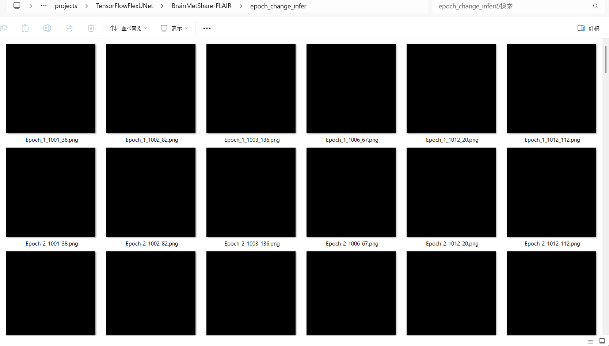 
 
<b>Epoch_change_inference output at middlepoint (epoch 23,24,25)</b> 
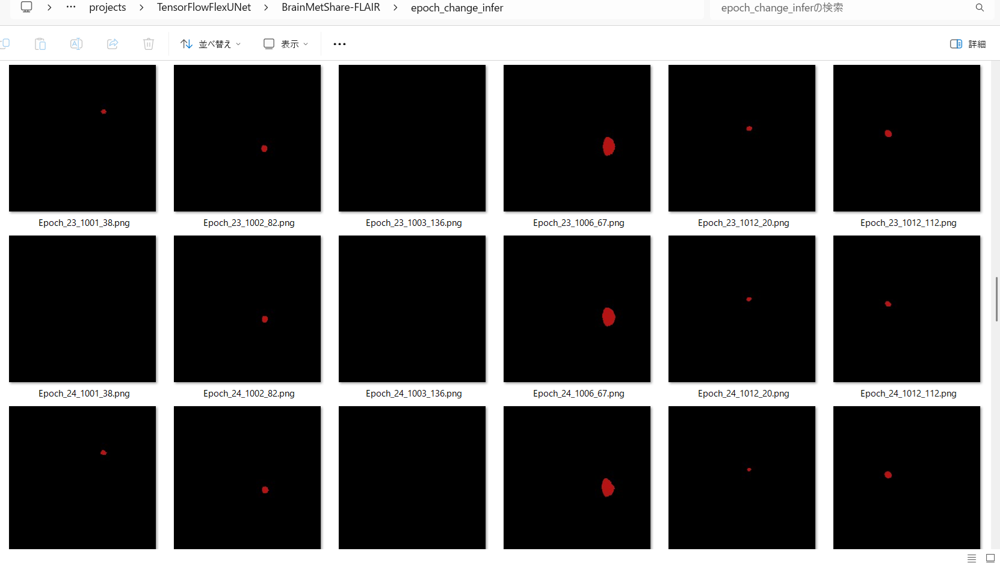 
 
<b>Epoch_change_inference output at ending (epoch 48,49,50)</b> 
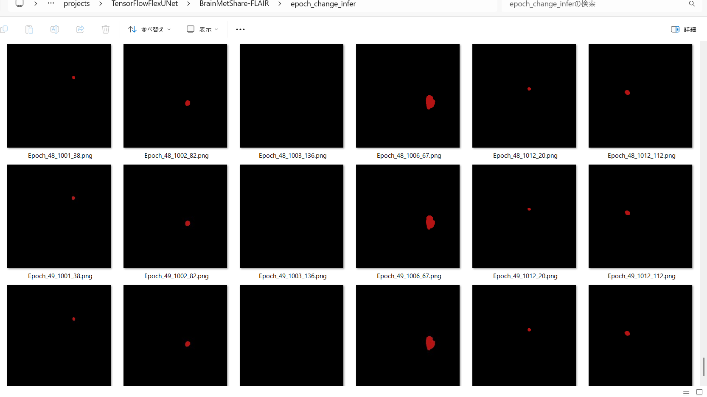 
 
In this experiment, the training process was terminated at epoch 50. 
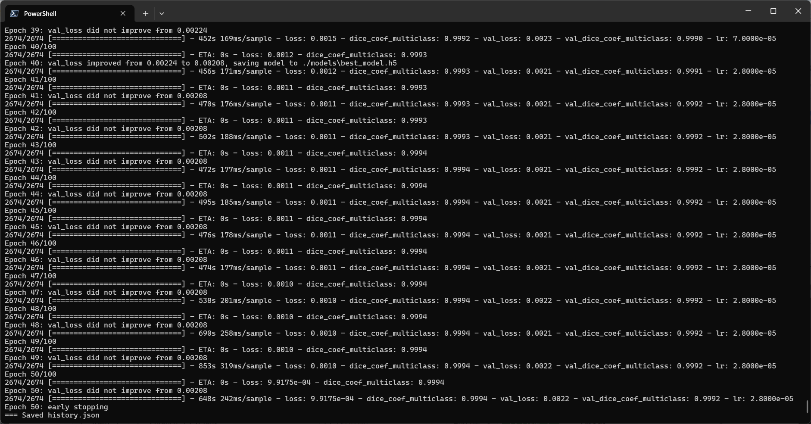 
 
<a href="./projects/TensorFlowFlexUNet/BrainMetShare-FLAIR/eval/train_metrics.csv">train_metrics.csv</a> 
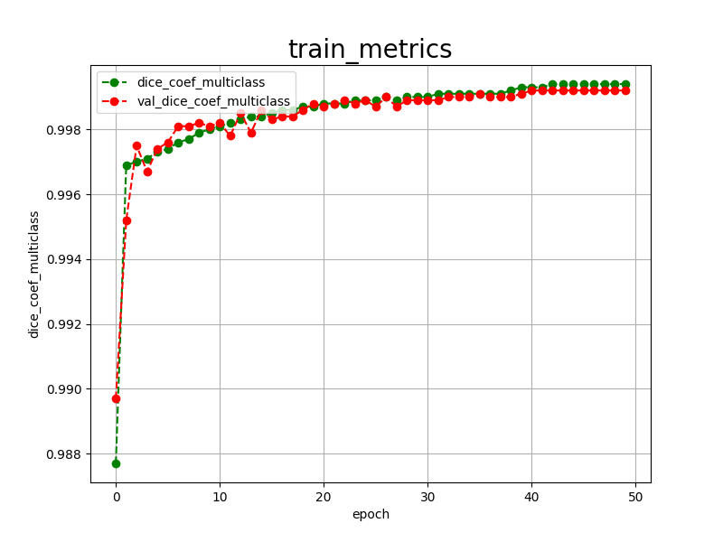 
 
<a href="./projects/TensorFlowFlexUNet/BrainMetShare-FLAIR/eval/train_losses.csv">train_losses.csv</a> 
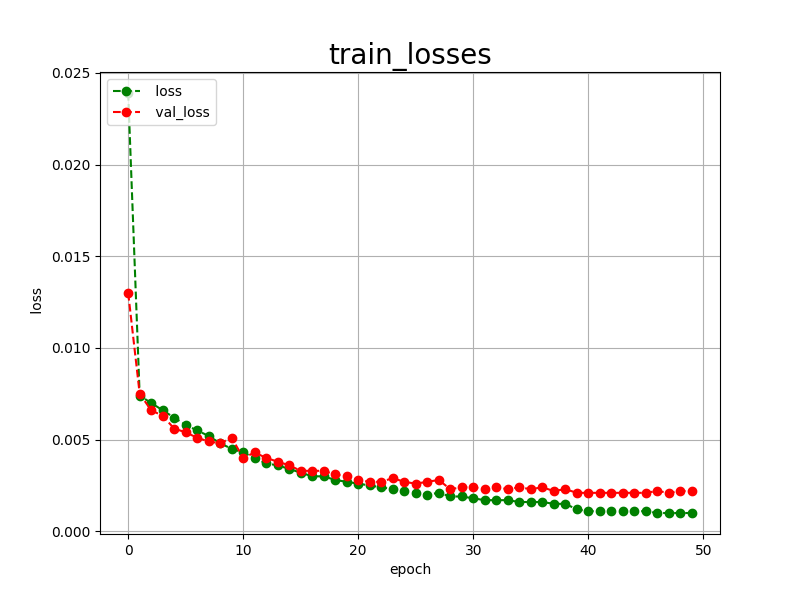 
 
<h3>
4. Evaluation
</h3>
Please move to <b>./projects/TensorFlowFlexUNet/BrainMetShare-FLAIR</b> folder,
and run the following bat file to evaluate the TensorFlowUNet model for BrainMetShare-FLAIR. 
<pre>
>./2.evaluate.bat
</pre>
This simply runs the following command.
<pre>
>python ../../../src/TensorFlowFlexUNetEvaluator.py ./train_eval_infer_aug.config
</pre>

Evaluation console output: 
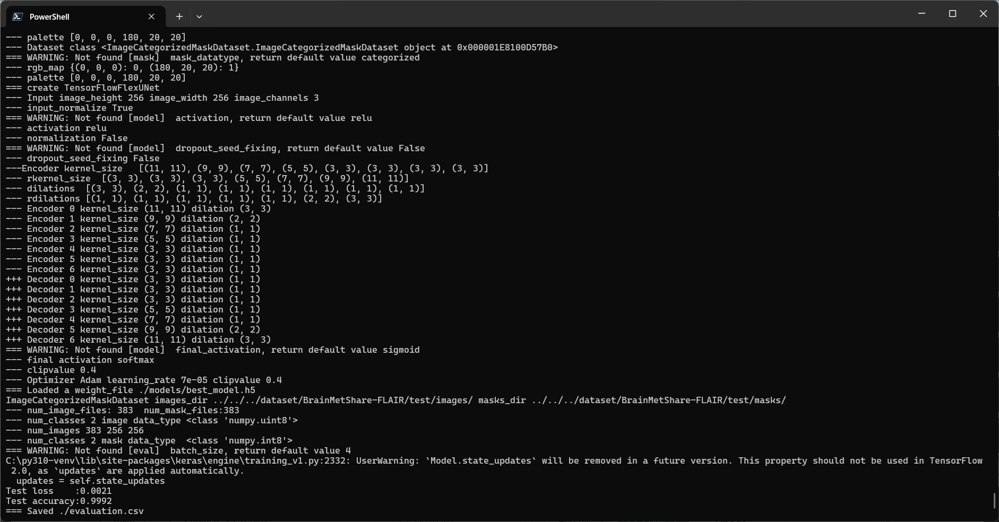
  Image-Segmentation-BrainMetShare-FLAIR

<a href="./projects/TensorFlowFlexUNet/BrainMetShare-FLAIR/evaluation.csv">evaluation.csv</a> 
The loss (categorical_crossentropy) to this BrainMetShare-FLAIR/test was low, and dice_coef_multiclass  
high, as shown below.
 
<pre>
categorical_crossentropy,0.0021
dice_coef_multiclass,0.9992
</pre>
 

<h3>
5. Inference
</h3>
Please move to <b>./projects/TensorFlowFlexUNet/BrainMetShare-FLAIR</b> folder
and run the following bat file to infer segmentation regions for images using the trained TensorFlowUNet model for
 BrainMetShare-FLAIR. 
<pre>
>./3.infer.bat
</pre>
This simply runs the following command.
<pre>
>python ../../../src/TensorFlowFlexUNetInferencer.py ./train_eval_infer_aug.config
</pre>

<b>mini_test_images</b> 
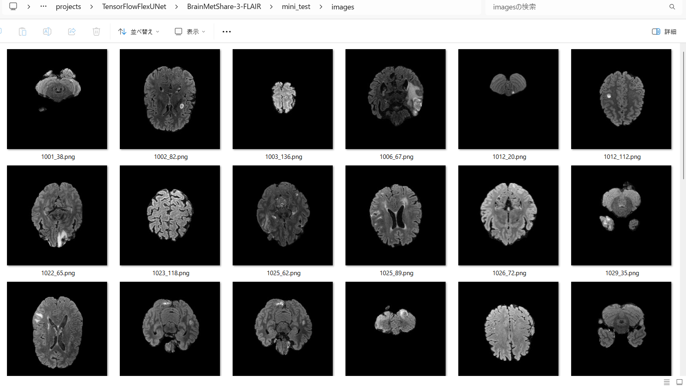 
<b>mini_test_mask(ground_truth)</b> 
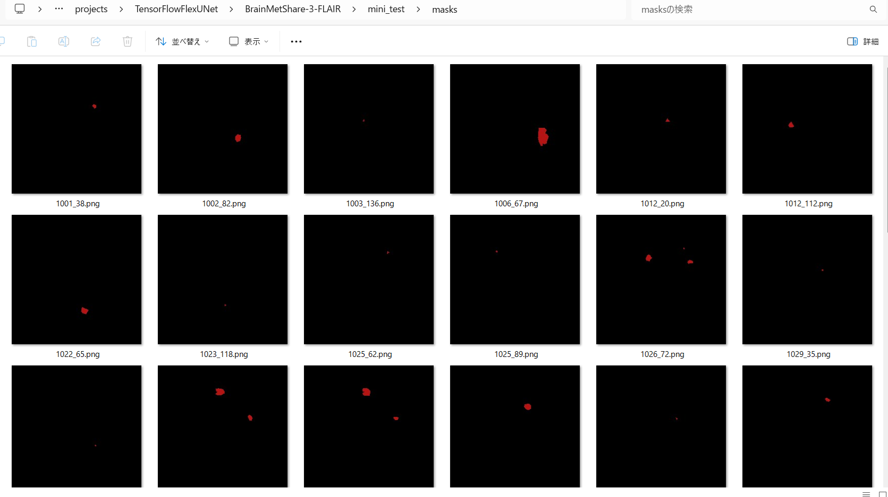 

<b>Inferred test masks</b> 
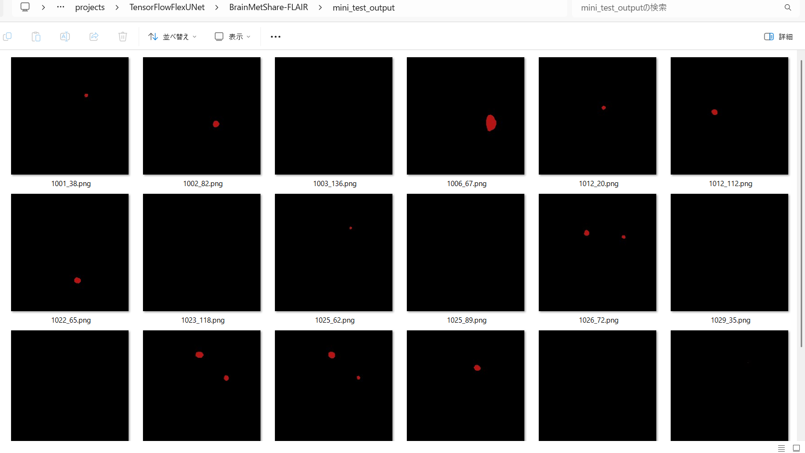 
 

<b>Enlarged images and masks for UCSF-PDGM-FLAIR  Images of 256x256 pixels</b> 
As shown below, the inferred masks look similar to the ground truth masks. 
 
<table>
<tr>
<th>Image</th>
<th>Mask (ground_truth)</th>
<th>Inferred-mask</th>
</tr>
<tr>
<td>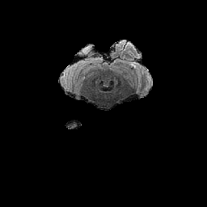</td>
<td></td>
<td></td>
</tr>
<tr>
<td>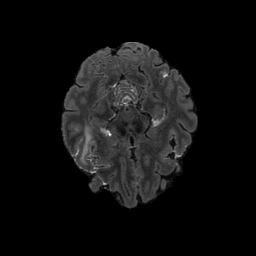</td>
<td></td>
<td></td>
</tr>
<tr>
<td>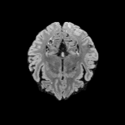</td>
<td></td>
<td></td>
</tr>
<tr>
<td>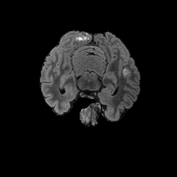</td>
<td></td>
<td></td>
</tr>
<tr>
<td>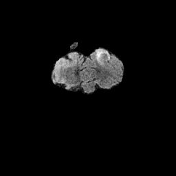</td>
<td></td>
<td></td>
</tr>
<tr>
<td>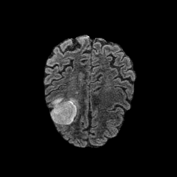</td>
<td></td>
<td></td>
</tr>
</table>

 
<h3>
6. 3D Volume Segmentation
</h3>
Please move to <b>./projects/TensorFlowFlexUNet/BrainMetShare-FLAIR</b> folder
and run the following bat file to infer image segmentation for 2D slices of 3D volume NIfTI files
 using the trained TensorFlowFlexUNet model for BrainMetShare-FLAIR. 
<pre>
>./5.infer3d.bat
</pre>
This simply runs the following command.
<pre>
>python ../../../src/TensorFlowFlexUNet3DInferencer.py ./train_eval_infer.config
</pre>
<b>infer3d section </b> in <a href="./projects/TensorFlowFlexUNet/BrainMetShare-FLAIR/train_eval_infer.config">
train_eval_infer.config
<a></b>
<pre>
[infer3d] 
; Specify an images_dir which contains NIfTI or NPY files
images_dir    = "./mini_test_3d/images/"
output_dir    = "./mini_test_3d_output/"
slice_shape_order = "hwd"
slice_normalize = True
slice_resize   = (256,256)
; Specify a cv2.rotation mode as a string.
slice_rotation = "cv2.ROTATE_90_COUNTERCLOCKWISE" 

mask_overlay  = True
</pre>

<b>Acutual Image Segmentation for 2D Slices of a BrainMetShare-FLAIR NIfTI</b> 
Some Slices, Inferred Masks and Mask overlays for a 3D volume <b>flair.nii</b> file 
in 
<b>train/Mets_006</b> folder. 
 
<a href="#1"><b>class-color-mapping-talbe</b></a> 
 
<table>
<tr>
<th>Image</th>
<th>Inferred-mask</th>
<th>Mask overlay</th>
</tr>

<tr>
<td></td>
<td></td>
<td>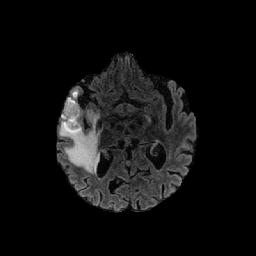</td>
</tr>

<tr>
<td>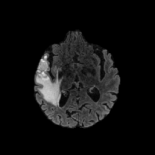</td>
<td></td>
<td>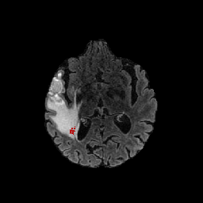</td>
</tr>
<tr>
<td>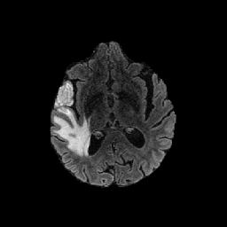</td>
<td></td>
<td>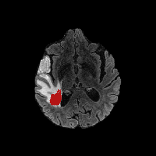</td>
</tr>
<tr>
<td>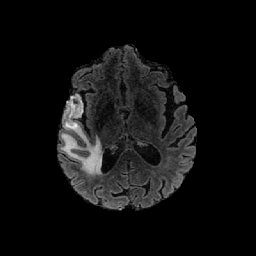</td>
<td></td>
<td>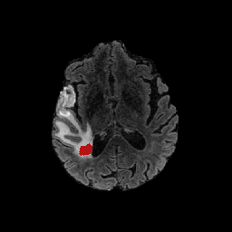</td>
</tr>
<tr>
<td>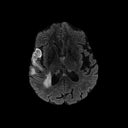</td>
<td></td>
<td>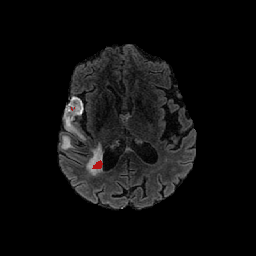</td>
</tr>
<tr>
<td>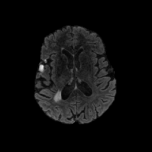</td>
<td></td>
<td>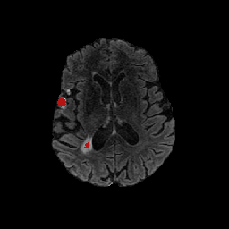</td>
</tr>
</table>

 
<h3>
7. MaskOverlay Video of 3D Volume Segmentation
</h3>
Please move to <b>./projects/TensorFlowFlexUNet/BrainMetShare-FLAIR</b> folder, and run the following bat file 
to generate <b>overlays.mp4</b> or <b>overlay.gif</b> for MaskOverlays of 3D Volume Segmentation.  
<pre>
>./6.video3d.bat
</pre>
This simply runs the following command.
<pre>
>python ../../../src/MaskOverlayVideoGenerator.py ./train_eval_infer.config
</pre>
 
<b>infer3d section </b> in <a href="./projects/TensorFlowFlexUNet/BrainMetShare-FLAIR/train_eval_infer.config">
train_eval_infer.config
<a></b>
<pre>
[infer3d] 
mask_overlay  = True
; Specify ".mp4" or ".gif".
;video_fileformat  = ".mp4"
video_fileformat  = ".gif"
</pre>
 
<b>overlays.gif</b> 

 
 
<h3>
References
</h3>
<b>1. Deep Learning Enables Automatic Detection and Segmentation
of Brain Metastases on Multi-Sequence MRI
</b> 
Endre Grøvik PhD, Darvin Yi MS, Michael Iv MD, Elisabeth Tong MD, Daniel L. Rubin MD MS, Greg Zaharchuk MD PhD 
<a href="https://arxiv.org/pdf/1903.07988">
https://arxiv.org/pdf/1903.07988
</a>
  
<b>2. TensorFlow-FlexUNet-Image-Segmentation-Brain-Metastases-MRI-Flair</b> 
Toshiyuki Arai 
<a href="https://github.com/sarah-antillia/TensorFlow-FlexUNet-Image-Segmentation-Brain-Metastases-MRI-Flair">
https://github.com/sarah-antillia/TensorFlow-FlexUNet-Image-Segmentation-Brain-Metastases-MRI-Flair
</a>
  
<b>3. TensorFlow-FlexUNet-Image-Segmentation-UCSF-BrainMetastases-Stereotactic-Radiosurgery-MRI</b> 
Toshiyuki Arai 
<a href="https://github.com/sarah-antillia/TensorFlow-FlexUNet-Image-Segmentation-UCSF-BrainMetastases-Stereotactic-Radiosurgery-MRI">
https://github.com/sarah-antillia/TensorFlow-FlexUNet-Image-Segmentation-UCSF-BrainMetastases-Stereotactic-Radiosurgery-MRI
</a>
  
<b>4. TensorFlow-FlexUNet-Image-Segmentation-Model</b> 
Toshiyuki Arai 
<a href="https://github.com/sarah-antillia/TensorFlow-FlexUNet-Image-Segmentation-Model">
https://github.com/sarah-antillia/TensorFlow-FlexUNet-Image-Segmentation-Model
</a>
  
